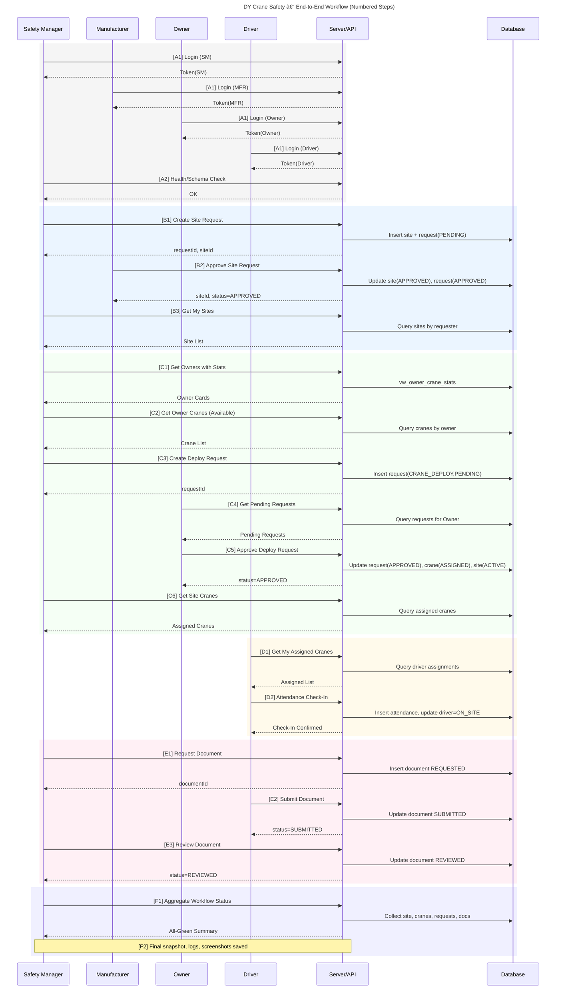

# End-to-End Workflow Sequence Diagram

This diagram illustrates the sequence of interactions between the different user roles (Actors) and the system (API/DB) for the entire business workflow.

```mermaid
sequenceDiagram
    title DY Crane Safety – End-to-End Workflow (Numbered Steps)

    participant SM as Safety Manager
    participant MFR as Manufacturer
    participant OWN as Owner
    participant DRV as Driver
    participant API as Server/API
    participant DB as Database

    %% Phase A: Auth & Env
    rect rgb(245,245,245)
      SM->>API: [A1] Login (SM)
      API-->>SM: Token(SM)
      MFR->>API: [A1] Login (MFR)
      API-->>MFR: Token(MFR)
      OWN->>API: [A1] Login (Owner)
      API-->>OWN: Token(Owner)
      DRV->>API: [A1] Login (Driver)
      API-->>DRV: Token(Driver)

      SM->>API: [A2] Health/Schema Check
      API-->>SM: OK
    end

    %% Phase B: Site Request/Approval
    rect rgb(235,245,255)
      SM->>API: [B1] Create Site Request
      API->>DB: Insert site + request(PENDING)
      API-->>SM: requestId, siteId

      MFR->>API: [B2] Approve Site Request
      API->>DB: Update site(APPROVED), request(APPROVED)
      API-->>MFR: siteId, status=APPROVED

      SM->>API: [B3] Get My Sites
      API->>DB: Query sites by requester
      API-->>SM: Site List
    end

    %% Phase C: Owner/Crane & Deploy Request
    rect rgb(245,255,245)
      SM->>API: [C1] Get Owners with Stats
      API->>DB: vw_owner_crane_stats
      API-->>SM: Owner Cards

      SM->>API: [C2] Get Owner Cranes (Available)
      API->>DB: Query cranes by owner
      API-->>SM: Crane List

      SM->>API: [C3] Create Deploy Request
      API->>DB: Insert request(CRANE_DEPLOY,PENDING)
      API-->>SM: requestId

      OWN->>API: [C4] Get Pending Requests
      API->>DB: Query requests for Owner
      API-->>OWN: Pending Requests

      OWN->>API: [C5] Approve Deploy Request
      API->>DB: Update request(APPROVED), crane(ASSIGNED), site(ACTIVE)
      API-->>OWN: status=APPROVED

      SM->>API: [C6] Get Site Cranes
      API->>DB: Query assigned cranes
      API-->>SM: Assigned Cranes
    end

    %% Phase D: Driver Assignment & Check-In
    rect rgb(255,250,235)
      DRV->>API: [D1] Get My Assigned Cranes
      API->>DB: Query driver assignments
      API-->>DRV: Assigned List

      DRV->>API: [D2] Attendance Check-In
      API->>DB: Insert attendance, update driver=ON_SITE
      API-->>DRV: Check-In Confirmed
    end

    %% Phase E: Documents
    rect rgb(255,240,245)
      SM->>API: [E1] Request Document
      API->>DB: Insert document REQUESTED
      API-->>SM: documentId

      DRV->>API: [E2] Submit Document
      API->>DB: Update document SUBMITTED
      API-->>DRV: status=SUBMITTED

      SM->>API: [E3] Review Document
      API->>DB: Update document REVIEWED
      API-->>SM: status=REVIEWED
    end

    %% Phase F: Aggregation & Artifacts
    rect rgb(240,240,255)
      SM->>API: [F1] Aggregate Workflow Status
      API->>DB: Collect site, cranes, requests, docs
      API-->>SM: All-Green Summary

      Note over SM,API: [F2] Final snapshot, logs, screenshots saved
    end
```
